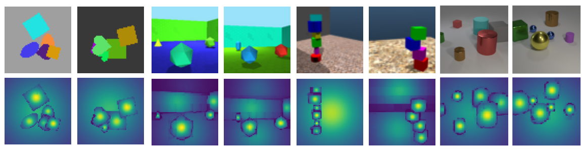

Official GitHub repository for **CVPR2025 accepted paper**: 
# Hierarchical Compact Clustering Attention (COCA) for Unsupervised Object-Centric Learning

[](https://arxiv.org/abs/2505.02071)
[](LICENSE)

## 🖼️ Teaser Figure

<p align="center">
  
</p>

## 🔗 Links
- [📄 Paper (arXiv)](https://arxiv.org/abs/2505.02071)
- [📄 Camera-ready PDF](paper.pdf)
- [🌐 Project Page](https://cankucuksozen.github.io/COCA)
- [🧠 BibTeX](bibtex.bib)

---

## 🧠 Abstract
We propose the **Compact Clustering Attention (COCA)** layer, an effective *building block* that introduces a *hierarchical strategy* for **object-centric representation learning**, while solving the unsupervised object discovery task on single images. COCA is an *attention-based clustering module* capable of extracting object-centric representations from multi-object scenes, when cascaded into a *bottom-up hierarchical network architecture*, referred to as COCA-Net. At its core, COCA utilizes a *novel clustering algorithm* that leverages the **physical concept of compactness, to highlight distinct object centroids in a scene, providing a spatial inductive bias**. Thanks to this strategy, COCA-Net generates high-quality segmentation masks on both the decoder side and, notably, the encoder side of its pipeline. Additionally, COCA-Net is not bound by a predetermined number of object masks that it generates and handles the segmentation of background elements better than its competitors. We demonstrate COCA-Net’s segmentation performance on six widely adopted datasets, achieving superior or competitive results against the state-of-the-art models across nine different evaluation metrics.

---

## 🛠️ Installation

Object-Centric Library by Dittadi et. al, **extended with proposed COCA-Net and state-of-the-art methods GEN-V2, INVSA, BOQSA** 

This Object-Centric Library is originally introduced by:
> [Generalization and Robustness Implications in Object-Centric Learning](https://arxiv.org/abs/2107.00637)
> Andrea Dittadi, Samuele Papa, Michele De Vita, Bernhard Schölkopf, Ole Winther, Francesco Locatello

and extended within the scope of this work. Building on the OCL library of Dittadi et al., we implement our propsed architecture COCA-Net and adapt the official implementations of three state-of-the-art OCL methods to our library. 

These methods and links to their original implementations are listed below;
> [GENESIS-V2: Inferring Unordered Object Representations without Iterative Refinement](https://github.com/applied-ai-lab/genesis)
> Martin Engelcke, Oiwi Parker Jones, and Ingmar Posner 

> [Invariant Slot Attention: Object Discovery with Slot-Centric Reference Frames](https://github.com/google-research/google-research/tree/master/invariant_slot_attention) 
> Ondrej Biza, Sjoerd van Steenkiste, Mehdi S. M. Sajjadi, Gamaleldin F. Elsayed, Aravindh Mahendran, Thomas Kipf 

> [Improving Object-centric Learning with Query Optimization](https://github.com/YuLiu-LY/BO-QSA) 
> Baoxiong Jia, Yu Liu, Siyuan Huang

Specific details concerning the functionalities of the original OCL library itself can be found in this GitHub repo: (https://github.com/addtt/object-centric-library). Now we reiterate over instructions laid out by Dittadi et al., on how to use this OCL library, focusing on our adoptations and needs:

Summary of out-of-the-box functionalities:
- **training** 8 object-centric models and 2 VAE baselines on 6 multi-object datasets (CLEVR, MultidSprites, Objects Room, Shapestacks, Tetrominoes, ClevrTex);
- **evaluating** trained models in terms of: 
  - object segmentation;
  - qualitative performance, e.g., showing reconstructions, decoder segmentation masks, encoder segmentation masks, and 
      separate reconstructions from each slot.

## Setting up the environment

1. Install requirements from [`requirements.txt`](requirements.txt). 
Example installation with [conda](https://docs.conda.io/projects/conda/en/latest/user-guide/install/index.html):

    ```shell
    conda create --name object_centric_lib python=3.8
    conda activate object_centric_lib
    
    # Optionally install PyTorch with a custom CUDA version. Example:
    # pip install torch torchvision --extra-index-url https://download.pytorch.org/whl/cu113
    
    pip install -r requirements.txt
    ```
    
    Note: PyTorch might have to be installed separately _before_ installing the requirements,
    depending on the required CUDA version
    (see the [PyTorch installation instructions](https://pytorch.org/get-started/locally/)).

    Python 3.8 recommended (&ge;3.8 required). 

2. Set the environment variable `OBJECT_CENTRIC_LIB_DATA` to the folder where the datasets should be stored.

   For example, on Linux or MacOS, add the following line to `~/.bashrc` (or `~/.zshrc`,
   depending on your shell):

   ```shell
    export OBJECT_CENTRIC_LIB_DATA=/path/to/datasets
    ```
   
   Then, restart the shell or run `. ~/.bashrc` (or `. ~/.zshrc`).

3. Download the datasets with [`download_data.py`](download_data.py).

    ```shell
    # Download all datasets
    python download_data.py -d all
    
    # Download all datasets, including style transfer versions
    python download_data.py -d all --include-style
    
    # Download only some datasets, without style transfer
    python download_data.py -d multidsprites clevr
    ```

    Each dataset is a `.hdf5` file and its metadata is in a corresponding
    `${DATASET_NAME}_metadata.npy` file. 

4. Check the integrity of the dataset files by running `python check_data.py`.

## Using the library

### Quick start

1. Train a model with default parameters:

    ```shell
    python train_object_discovery.py model=clus-attention dataset=multidsprites
    ```
    
    This saves the model and the logs by default in `outputs/runs/${MODEL}-${DATASET}-${DATETIME}`.

2. Resume training of a run, given the path to the root folder `${RUN_ROOT}` of the run:

    ```shell
    python train_object_discovery.py model=clus-attention dataset=multidsprites hydra.run.dir=${RUN_ROOT} allow_resume=true
    ```

3. Evaluate reconstruction and segmentation metrics, given `${RUN_ROOT}` (the path to the
root folder of the run):

    ```shell
    python eval_metrics.py checkpoint_path=outputs/runs/clus-attention-multidsprites-YYYY-MM-DD_HH-MM-SS
    ```

5. Save visualizations (reconstructions, masks, slot reconstructions):

    ```shell
    python eval_qualitative.py checkpoint_path=outputs/runs/clus-attention-multidsprites-YYYY-MM-DD_HH-MM-SS
    ```
   
All evaluation results are saved in `${RUN_ROOT}/evaluation`, e.g., `outputs/runs/monet-multidsprites-YYYY-MM-DD_HH-MM-SS/evaluation`.

With our extension, the library currently includes the following models:
- [COCA-Net] - `clus-attention`
- [BOQSA](https://arxiv.org/abs/2210.08990) - `boq-slot-attention`
- [INVSA](https://arxiv.org/abs/2302.04973) - `inv-slot-attention`
- [GEN-v2](https://arxiv.org/abs/2104.09958) - `genesis-v2`
- [GENESIS](https://arxiv.org/abs/1907.13052) - `genesis`
- [MONet](https://arxiv.org/abs/1901.11390) - `monet`
- [Slot Attention](https://arxiv.org/abs/2006.15055) - `slot-attention`
- [SPACE](https://arxiv.org/abs/2001.02407) - `space`
- Standard VAE - `baseline_vae_mlp`
- VAE with [broadcast decoder](https://arxiv.org/abs/1901.07017) - `baseline_vae_broadcast`

and the following datasets:
- [CLEVR](https://cs.stanford.edu/people/jcjohns/clevr/) - `clevr` (the original dataset has 10 objects: to train on CLEVR6, add `+dataset.variant=6` to the command line)
- [Multi-dSprites](https://github.com/deepmind/multi_object_datasets) - `multidsprites`
- [Objects Room](https://github.com/deepmind/multi_object_datasets) - `objects_room`
- [Shapestacks](https://ogroth.github.io/shapestacks/) - `shapestacks`
- [Tetrominoes](https://github.com/deepmind/multi_object_datasets) - `tetrominoes`
- [ClevrTex](https://arxiv.org/abs/2111.10265) - `clevrtex`

Read the following sections for further details.

### Training a model

```shell
python train_object_discovery.py model=${MODEL} dataset=${DATASET}
```

This command trains the specified model on the specified dataset, with default 
parameters defined by the [hydra](https://hydra.cc/) configuration files in [`config/`](config/).
The base config file for this script is [`config/train_object_discovery.yaml`](config/train_object_discovery.yaml).

The run folder is handled by hydra, and by default it is `outputs/runs/${MODEL}-${DATASET}-${DATETIME}`.
This can be customized using hydra by adding, e.g., `hydra.run.dir=outputs/runs/${model.name}-${dataset.name}`
to the command line.

The model and dataset correspond to config files -- e.g., `model=clus-attention` reads the model
config from [`config/model/clus-attention.yaml`](config/model/clus-attention.yaml) and `dataset=multidsprites` reads the
dataset config from [`config/dataset/multidsprites.yaml`](config/dataset/multidsprites.yaml).
In some cases we define custom parameters for specific combinations of dataset and model: these are
defined in the folder [`config/special_cases`](config/special_cases).

Dataset variants can define dataset filters or transforms to test robustness to distribution shifts.
A variant is picked by adding `+dataset.variant=${VARIANT}` to the command line: e.g. 
CLEVR6 is `dataset=clevr +dataset.variant=6`, and Tetrominoes with pad and random crop is
`dataset=tetrominoes +dataset.variant=pad_and_randomcrop`.
For more information on dataset variants, see [`config/dataset/variants/readme.md`](config/dataset/variants/readme.md).

All models are configured through hydra, including the training setup. The default parameters 
are defined in the model's YAML file, and these can be overridden from the command line.


### Evaluation: metrics

```shell
python eval_metrics.py checkpoint_path=/path/to/run/folder
```

This command evaluates the reconstruction error (MSE) and 3 segmentation metrics (ARI, SC, mSC).
Typically no customization is necessary, but see [`config/eval_metrics.yaml`](config/eval_metrics.yaml).

In order to evaluate encoder generated segmentation masks, set `include_attn = true` in MetricsEvaluator of eval_metrics.py

To take background segments into consideration, set `skip_background = false` in MetricsEvaluator of eval_metrics.py

### Evaluation: save visualizations

```shell
python eval_qualitative.py checkpoint_path=/path/to/run/folder
```

This command saves model visualizations, and typically does not require customization.
The `seed`, `debug`, `overwrite`, and `device` flags are also available here.

---

## 📜 License
- Code: [MIT License](LICENSE)
- Website text/images: [CC BY-NC 4.0](https://creativecommons.org/licenses/by-nc/4.0/)
